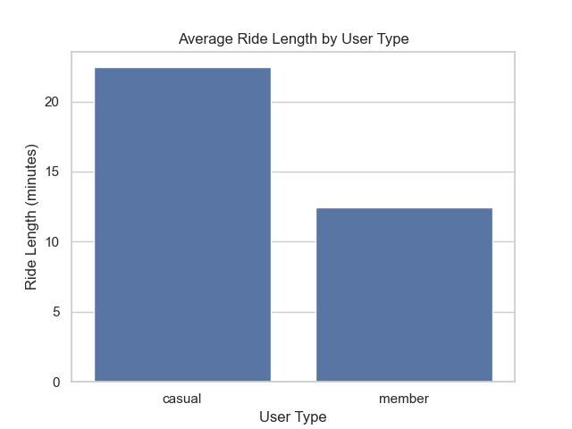
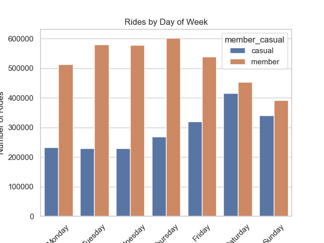
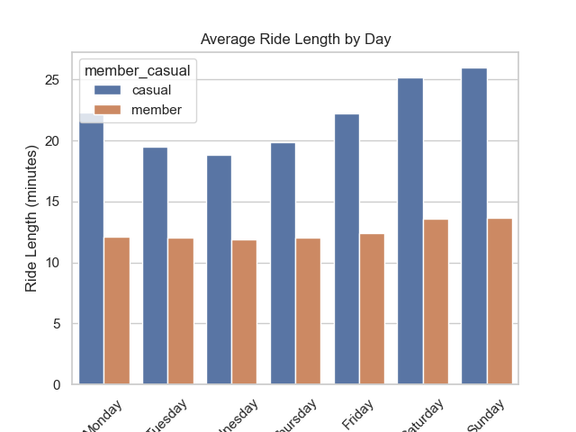

# 🚴 Cyclistic Bike-Share Analysis

## 📌 Project Overview
This project analyzes behavioral differences between **casual riders** and **annual members** of Cyclistic, a bike-share company, to support data-driven marketing strategies aimed at increasing membership conversions.

---

## 🎯 Business Problem
Cyclistic aims to maximize profitability by increasing the number of annual members. This project answers:

> **How do casual riders and annual members use bikes differently?**

---

## 🧠 Key Insights

- **Ride Duration**  
  Casual riders take significantly longer rides, indicating leisure usage.

- **Usage Frequency**  
  Annual members take more rides overall, showing habitual usage.

- **Weekly Patterns**  
  - Casual riders → peak on weekends  
  - Members → consistent weekday usage (commuting behavior)

---

## 📊 Visualizations

### Average Ride Length

### Ride Count by User Type

### Rides by Day of Week

### Average Ride Length by Day

---

## 🛠️ Tools & Technologies
- Python (Pandas, NumPy)
- Data Visualization (Matplotlib, Seaborn)
- Git & GitHub
- CSV Data Processing

---

## ⚙️ Project Workflow

1. **Ask** – Defined business problem  
2. **Prepare** – Collected and structured 12 months of trip data  
3. **Process** – Cleaned and transformed data  
4. **Analyze** – Identified behavioral patterns  
5. **Share** – Created visualizations  
6. **Act** – Delivered business recommendations  

---

## 📂 Project Structure
